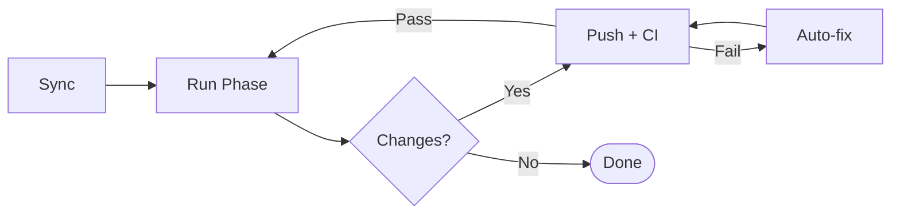

# iterative-improve

[](https://github.com/ktenman/iterative-improve/actions/workflows/ci.yml)
[](https://github.com/ktenman/iterative-improve/actions/workflows/codeql.yml)

Automate the feedback loop between Claude Code and your CI pipeline.

Researchers tweak parameters in small steps until results improve. Same idea, but for code. One-shot Claude is hit or miss, so `iterative-improve` puts it in a loop. It runs your branch through multiple passes (cleanup, review, security), commits fixes, and waits for CI. Build breaks? Error logs go back to Claude for another try. One command, walk away, green build.

The approach is grounded in [Self-Refine](https://arxiv.org/abs/2303.17651) (Madaan et al. 2023) and [Reflexion](https://arxiv.org/abs/2303.11366) (Shinn et al. 2023). More in [Background & References](#background--references).

## Install

```bash
uv tool install git+https://github.com/ktenman/iterative-improve
```

Or clone and install locally:

```bash
git clone https://github.com/ktenman/iterative-improve
cd iterative-improve
uv tool install .
```

## Update

```bash
uv tool upgrade iterative-improve
```

## Requirements

- Python >= 3.10
- [`uv`](https://docs.astral.sh/uv/) (package manager)
- [`claude`](https://claude.ai/code) CLI (Claude Code)
- [`gh`](https://cli.github.com/) CLI (GitHub)
- `git`

## Usage

```bash
# Default: run all phases (simplify + review + security)
iterative-improve -n 5

# Batch mode: run all phases, then CI once (faster)
iterative-improve -n 5 --batch

# Parallel mode: run phases concurrently in git worktrees (fastest)
iterative-improve -n 5 --parallel

# Run specific phases only
iterative-improve -n 5 --phases simplify,review
iterative-improve -n 5 --phases security

# Squash all branch commits into one when done
iterative-improve -n 5 --squash

# Resume after Ctrl+C
iterative-improve -n 5 --batch --resume

# Skip CI checks (local-only)
iterative-improve -n 3 --skip-ci
```

## Options

| Flag | Default | Description |
|------|---------|-------------|
| `-n` | 10 | Number of iterations |
| `--phases` | `simplify,review,security` | Comma-separated phases to run |
| `--batch` | off | Run all phases then CI once per iteration (mutually exclusive with `--parallel`) |
| `--parallel` | off | Run phases concurrently in git worktrees (mutually exclusive with `--batch`) |
| `--squash` | off | Squash all branch commits into one after finishing |
| `--resume` | off | Resume from saved state after interruption |
| `--skip-ci` | off | Skip CI checks |
| `--ci-timeout` | 15 | CI timeout in minutes |

## Phases

| Phase | What it does |
|-------|-------------|
| **simplify** | Finds duplicated code, overly complex logic, inefficient patterns, dead code |
| **review** | Finds bugs, performance issues, missing edge cases, API contract violations |
| **security** | Finds injection attacks, auth flaws, data exposure, path traversal, dependency issues |

## How it works



Each iteration:

1. **Sync**: pulls latest `main`, auto-merges if needed
2. **Analyze**: Claude looks at the branch diff. Runs whatever phases you configured
3. **Push**: stages fixes, writes a commit message, pushes
4. **CI check**: sits and waits for GitHub Actions. If the build breaks, it grabs the logs and retries (up to 5 times)
5. **Done**: bails out once nothing changes

In **batch mode**, all phases run first, then CI checks once per iteration (faster for branches with many changes).

In **parallel mode**, each phase runs in its own git worktree simultaneously via `ThreadPoolExecutor`. Changes are merged back and committed as one. This is the fastest mode — 3x faster than sequential when running all 3 phases.

With **`--squash`**, all commits on the branch are squashed into a single commit with a summary after iterations complete.

All state lives in `.improve-loop/` (state.json + run.log). Hit Ctrl+C and pick up where you left off with `--resume`.

## Background & References

Under the hood, this is just **iterative self-refinement**. LLMs tend to write better code when you let them critique their own work. The key part is showing them the actual error logs when things break, not just asking again blindly. It loops until CI goes green.

Related research:

- [Self-Refine](https://arxiv.org/abs/2303.17651) (Madaan et al., 2023): LLMs critique and revise their own output in loops
- [Reflexion](https://arxiv.org/abs/2303.11366) (Shinn et al., 2023): verbal feedback from failures drives better retries
- [Automated Program Repair](https://doi.org/10.1145/3318162) (Le Goues et al., 2019): the broader field this builds on

## Architecture

```
src/improve/
├── cli.py      Argument parsing, logging setup, entry point
├── loop.py     IterationLoop class: orchestration, signal handling, phase execution
├── parallel.py Parallel phase execution using git worktrees
├── claude.py   Claude subprocess with streaming JSON output
├── ci.py       GitHub Actions polling via gh CLI
├── git.py      Git operations: diff, commit, push, sync, squash, worktrees, conflict resolution
├── process.py  Subprocess wrapper, tool validation
├── prompt.py   Phase prompts, summary extraction, commit messages
├── state.py    LoopState/PhaseResult dataclasses, JSON persistence
└── version.py  Update checker
```

## Development

```bash
# Install dev dependencies
uv sync --dev

# Lint
uv run ruff check src/ tests/
uv run ruff format --check src/ tests/

# Test with coverage
uv run pytest -v --tb=short --cov=improve --cov-report=term-missing

# Auto-fix lint issues
uv run ruff check --fix src/ && uv run ruff format src/
```

## Releasing

Merge to `main`. The release workflow auto-bumps the patch version, creates a git tag, and publishes a GitHub release.

## License

[Creative Commons Attribution 4.0 International (CC BY 4.0)](LICENSE)
