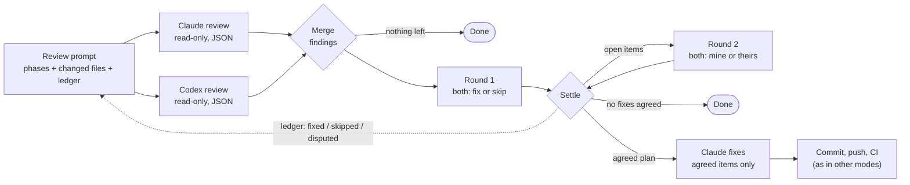
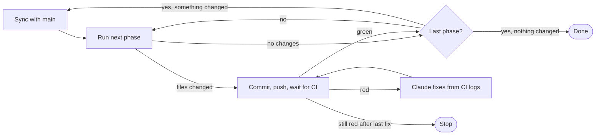

# iterative-improve

[](https://github.com/ktenman/iterative-improve/actions/workflows/ci.yml)
[](https://github.com/ktenman/iterative-improve/actions/workflows/codeql.yml)

Automate the feedback loop between Claude Code and your CI pipeline.

Researchers tweak parameters in small steps until results improve. Same idea, but for code. One-shot Claude is hit or miss, so `iterative-improve` puts it in a loop. It runs your branch through multiple passes (cleanup, review, security), commits fixes, and waits for CI. Build breaks? Error logs go back to Claude for another try. One command, walk away, green build.

Want a second opinion? With `--council`, Claude and OpenAI's Codex review the branch together, and Claude fixes only what both agree on. See [Council mode](#council-mode).

The approach combines iterative self-refinement ([Self-Refine](https://arxiv.org/abs/2303.17651), [Reflexion](https://arxiv.org/abs/2303.11366)) with a [quality ratchet](https://leaddev.com/software-quality/introducing-quality-ratchets-tool-managing-complex-systems) — the LLM drives improvements, CI prevents regressions. More in [Background & References](#background--references).

## Install

```bash
uv tool install git+https://github.com/ktenman/iterative-improve
```

Or clone and install locally:

```bash
git clone https://github.com/ktenman/iterative-improve
cd iterative-improve
uv tool install .
```

## Update

```bash
uv tool upgrade iterative-improve
```

## Requirements

- Python >= 3.10
- [`uv`](https://docs.astral.sh/uv/) (package manager)
- [`claude`](https://claude.ai/code) CLI (Claude Code), logged in, with access to [Claude Opus with 1M context](https://code.claude.com/docs/en/model-config#extended-context-with-1m) (included on Max, Team and Enterprise plans; Pro plans need usage credits)
- [`gh`](https://cli.github.com/) CLI (GitHub) or [`glab`](https://gitlab.com/gitlab-org/cli) CLI (GitLab), logged in
- For `--council` only: the [`codex`](https://github.com/openai/codex) CLI, logged in, with access to the model you pass in `--codex-model` (default `gpt-6-astra`)
- `git`, with an `origin` remote you can push to

The repository's base branch must be called `main`: the tool compares your branch with it, merges `origin/main` into your branch, and squashes onto it.

## Usage

Run it from the root of the repository, on the feature branch you want to improve:

```bash
cd path/to/repo
git switch my-feature     # not main/master, and the working tree must be clean
iterative-improve -n 3
```

More examples:

```bash
# Default: run until an iteration changes nothing (all phases)
iterative-improve

# Cap at 5 iterations
iterative-improve -n 5

# Batch mode: run all phases, then CI once (faster)
iterative-improve -n 5 --batch

# Parallel mode: run phases concurrently in git worktrees (fastest)
iterative-improve -n 5 --parallel

# Run specific phases only
iterative-improve -n 5 --phases simplify,review
iterative-improve -n 5 --phases security

# Council mode: Claude and Codex review, Claude fixes what both agree on
iterative-improve -n 3 --council

# Faster, cheaper council iterations
iterative-improve -n 3 --council --effort medium

# Another Codex model
iterative-improve -n 3 --council --codex-model <model>

# Squash all branch commits into one when done
iterative-improve -n 5 --squash

# Resume after Ctrl+C (pass the same flags again)
iterative-improve -n 5 --batch --resume

# Don't wait for CI (commits are still pushed)
iterative-improve -n 3 --skip-ci

# Use GitLab CI instead of GitHub Actions
iterative-improve -n 5 --ci-provider gitlab

# Watch a specific GitHub Actions workflow
iterative-improve -n 5 --ci-workflow "Build and Test"

# Adjust timeouts
iterative-improve -n 5 --phase-timeout 300 --ci-timeout 20

# Disable colored output
iterative-improve -n 5 --no-color
```

## Options

| Flag | Default | Description |
|------|---------|-------------|
| `-n`, `--iterations` | until nothing changes | Max iterations |
| `--phases` | `simplify,review,security` | Comma-separated phases to run, in this order |
| `--batch` | off | Run all phases, then check CI once per iteration. Can't be combined with `--parallel` or `--council` |
| `--parallel` | off | Run all phases at the same time in git worktrees, then check CI once. Can't be combined with `--batch` or `--council` |
| `--council` | off | Claude and Codex review together; Claude fixes only what both agree on. See [Council mode](#council-mode). Can't be combined with `--batch` or `--parallel` |
| `--effort` | `max` | `max` or `medium`, for every Claude and Codex call except merge-conflict resolution, which always uses `max` |
| `--codex-model` | `gpt-6-astra` | Codex model for `--council`. Model names change often; the tool checks the model before it starts |
| `--squash` | off | Squash all branch commits into one after finishing (force-pushes) |
| `--resume` | off | Continue from saved state after an interruption |
| `--skip-ci` | off | Don't wait for CI and skip the `gh`/`glab` login checks. Commits are still pushed |
| `--ci-timeout` | 15 | Minutes to wait for a CI run to finish (minimum 1) |
| `--ci-provider` | auto-detect | `github` or `gitlab`. Auto-detect picks `gitlab` if the `origin` URL contains "gitlab", otherwise `github` |
| `--ci-workflow` | auto-detect | GitHub Actions workflow to watch. Auto-detect looks for an active workflow named `ci`, then `build`, `test`, `tests`, `pipeline` (any case). If none matches, it watches the latest run of any workflow |
| `--phase-timeout` | 2700 at `max`, 900 at `medium` | Seconds before a Claude or Codex call is killed (minimum 30). Merge-conflict resolution always uses 900 |
| `--no-color` | off | Disable colored output (also respects `NO_COLOR` env var) |

## How Claude is run

Every Claude call starts a fresh, non-interactive Claude Code session (council rounds continue the review's session). That covers each phase, each CI fix, merge-conflict resolution, and the `--squash` commit message:

```bash
claude -p --output-format stream-json --verbose --include-partial-messages \
  --dangerously-skip-permissions --model 'opus[1m]' --effort <--effort>
```

- **Model `opus[1m]`**: the newest Claude Opus with the 1M-token context window.
- **Effort**: `--effort`, `max` by default. `max` is the highest reasoning effort and also uses the most tokens; `medium` is faster and cheaper. Merge-conflict resolution always uses `max`.
- **Council reviews and rounds** add `--disallowedTools Edit,Write,NotebookEdit`, `--json-schema <schema>` and `--session-id <uuid>` (review) or `--resume <uuid>` (rounds). Claude can still run shell commands there, so the tool discards any file a reviewer changes.
- **Overrides**: both flags take precedence over your own choices (`/model` and the `model` and `effortLevel` settings). The exception is the `CLAUDE_CODE_EFFORT_LEVEL` environment variable, which replaces `--effort` if it's set. Limits still apply: a `maxEffortLevel` setting caps the effort, and an organization's model allowlist can block the model.
- **No permission prompts**: `--dangerously-skip-permissions` lets Claude edit files and run any command in your repo without asking. Only run the tool on code you trust.
- **Your Claude Code setup still applies**: your login, your `CLAUDE.md` files and the rest of your Claude Code configuration. Put project rules in `CLAUDE.md`.
- **Output**: the prompt is sent on stdin. Claude's reply is streamed to your terminal (except in `--parallel` mode and for the squash message), and each tool call is logged as one line.

## Phases

| Phase | What Claude is asked to do |
|-------|----------------------------|
| **simplify** | Make the changed code simpler without changing its behavior: less nesting and duplication, clearer names, the conventions in `CLAUDE.md` |
| **review** | Fix real bugs (logic errors, null handling, race conditions, leaks, performance problems) and `CLAUDE.md` violations |
| **security** | Fix security holes (injection, auth flaws, exposed secrets, insecure deserialization, path traversal, vulnerable dependencies) and error-handling problems (silent failures, catch blocks that are too broad) |

Each phase is given the names of the files your branch changed compared with `main`, plus summaries of what earlier iterations already fixed. Claude edits the files directly, runs the project's lint/format/test commands where appropriate, and ends with a one-line summary that becomes the commit message. `review` and `security` only fix issues they're highly confident about, and they ignore problems that existed before your changes. The full prompts are in [`improve/phases.py`](improve/phases.py).

## Council mode

`--council` replaces the phase-by-phase loop with a two-model review. Claude and [Codex](https://github.com/openai/codex) review the branch at the same time, without editing anything. They agree on a fix plan in at most two rounds, and **Claude implements only the agreed items**. Codex never writes files.

> **Leave the repo alone while council mode runs.** Any file that changes during the reviews or rounds counts as a reviewer's edit: the tool then restores the tracked files that changed and deletes the untracked ones. Files that change while Claude implements the fix are committed with it.


```mermaid
flowchart LR
    P["Review prompt<br/>phases + changed files + ledger"] --> RC["Claude review<br/>read-only, JSON"]
    P --> RX["Codex review<br/>read-only, JSON"]
    RC --> M{"Merge<br/>findings"}
    RX --> M
    M -- nothing left --> STOP1(["Done"])
    M --> R1["Round 1<br/>both: fix or skip"]
    R1 --> S{"Settle"}
    S -- open items --> R2["Round 2<br/>both: mine or theirs"]
    R2 --> S
    S -- no fixes agreed --> STOP2(["Done"])
    S -- agreed plan --> F["Claude fixes<br/>agreed items only"]
    F --> C["Commit, push, CI<br/>(as in other modes)"]
    S -. ledger: fixed / skipped / disputed .-> P
```

### One iteration

1. **Review.** Both models get the same prompt:
   - the focus areas of every phase in `--phases`;
   - the files your branch changed;
   - the ledger of findings earlier iterations already settled.

   Each model answers with JSON findings: phase, file, function (`symbol`), line, severity, confidence, title, detail and a suggested fix.
2. **Merge.** Findings about the same function in the same file count as one. If either finding names no function, they match when their lines are at most 3 apart. A finding is kept if any of these holds:
   - both models reported it;
   - its severity is high or critical;
   - its confidence is 50 or more.

   Findings in files your branch didn't change, and findings the ledger already settled, are dropped. **If nothing is left, the loop stops.**
3. **Round 1.** Both models answer `fix` or `skip` for every finding, with an approach and a reason, at the same time. A finding both want to skip is settled. A finding either model leaves out is **unanswered**: it isn't fixed and isn't settled, so the next iteration can raise it again.
4. **Round 2** (only for findings still open). Each model sees both positions and picks `mine` or `theirs`:
   - one `mine` and one `theirs`: that version wins;
   - both `theirs`: Claude's version, since Claude implements it;
   - both `mine`, or a missing or invalid pick: **disputed**. The finding isn't fixed, and the final summary lists it for you.

   If the winning version says `skip`, the finding is skipped.
5. **Fix.** If no fix was agreed, the loop stops. Otherwise a fresh Claude session gets only the agreed findings and approaches, implements them, and runs your full test suite.
6. **Ship.** Changed files are committed and pushed. CI is checked, and fixed by Claude if it fails, as in the other modes. Fixed, skipped and disputed findings go into the ledger in `.improve-loop/state.json`. Later iterations and `--resume` never raise a skipped or disputed finding again, and raise a fixed one only if the fix is wrong or caused a new problem.

The loop also stops when:
- the agreed fix changes no files;
- a push fails;
- CI still fails after Claude's fixes;
- an iteration crashes twice in a row (for example, an agent call times out). After a single crash, the iteration is retried;
- an iteration crashes after its fix was already pushed, since the CI result is then unknown.

### Roles

| | Claude | Codex |
|---|---|---|
| Review | ✅ read-only (edit tools turned off) | ✅ read-only (OS sandbox) |
| Agree on the plan | ✅ | ✅ |
| Write code (fixes, CI fixes, conflict resolution, squash message) | ✅ | ❌ never |

### How Codex is run

```bash
# Review: a new read-only session. The thread id comes from the thread.started event.
codex exec --json -s read-only -m gpt-6-astra -c model_reasoning_effort=max \
  -c 'project_doc_fallback_filenames=["CLAUDE.md"]' \
  --output-schema <schema file> -o <reply file> -

# Rounds 1 and 2 continue the same thread
codex exec resume <thread id> --json -c sandbox_mode=read-only -m gpt-6-astra \
  -c model_reasoning_effort=max -c 'project_doc_fallback_filenames=["CLAUDE.md"]' \
  --output-schema <schema file> -o <reply file> -
```

- The prompt is sent on stdin. The schema and reply files live in a temporary directory outside your repo.
- `project_doc_fallback_filenames` makes Codex follow your `CLAUDE.md` when the repo has no `AGENTS.md`.
- Your Codex login and `~/.codex/config.toml` still apply. `-m` and `model_reasoning_effort` override the model and effort set there.
- Before the first iteration, the tool sends Codex one short prompt with your `--codex-model` and `--effort`. If the model or effort isn't available on your login, it stops with Codex's error.
- Ctrl+C stops Codex as well as Claude.

### Time and cost

Council mode is slow at the default `--effort max`. In the benchmark behind [#60](https://github.com/ktenman/iterative-improve/issues/60):
- One iteration took about 40 minutes and about $20 of Claude usage (Claude Code's own estimate), plus about 5M Codex tokens.
- `--effort medium` was about 15 times faster and 7 times cheaper, but it missed the deepest bug the `max` runs found.
- On a subscription, a long run can hit Claude's usage limit. The iteration then fails, and the loop stops after the second failure in a row. Continue later with `--resume`.

## How it works

Sequential mode (the default):


```mermaid
flowchart LR
    S[Sync with main] --> P[Run next phase]
    P -->|files changed| C[Commit, push, wait for CI]
    P -->|no changes| L{Last phase?}
    C -->|green| L
    C -->|red| F[Claude fixes from CI logs] --> C
    C -->|still red after last fix| X([Stop])
    L -->|no| P
    L -->|yes, something changed| S
    L -->|yes, nothing changed| D([Done])
```

Before the first iteration, the tool checks that:

- `git`, `claude` and `gh`/`glab` are installed (plus `codex` with `--council`)
- you're on a branch other than `main`/`master`
- there are no unresolved merge conflicts (if there are, Claude tries to resolve and commit them)
- the working tree is clean (`.improve-loop/` doesn't count)
- the remote is reachable and you can push to it
- `gh`/`glab` is logged in and can see the repository (skipped with `--skip-ci`)
- with `--council`: Codex can use `--codex-model` at `--effort`

In the background, it also checks GitHub for a newer release and prints an upgrade hint if there is one.

Each iteration:

1. **Sync**: fetches `origin/main`. If your branch is behind, the tool merges `origin/main` into it and pushes. If the merge conflicts, Claude resolves the conflicts; if that fails, the loop stops.
2. **Phases**: runs each active phase. If Claude changed files, only those files are committed and pushed.
3. **CI**: waits for the new CI run and watches it for up to `--ci-timeout` minutes.
   - If no new run appears within 3 minutes, the tool assumes the push didn't trigger CI and moves on.
   - If the run was cancelled (for example, replaced by a newer push), the tool follows the newer run, up to 3 times.
   - If the run fails or times out, the end of the failure logs goes to Claude, with values like `API_TOKEN=...` redacted. Claude's fix is committed and pushed, and CI runs again, for up to 5 attempts.
4. **Stop or continue**:
   - If CI still fails after Claude's last fix attempt, or a push fails, the loop stops.
   - A phase that changed nothing is dropped from later iterations.
   - A phase that crashes is logged, its changes to tracked files are discarded, and it runs again next iteration.
   - The loop ends when an iteration changes nothing or the `-n` limit is reached. It then prints a summary of the results.

### Modes

- **Sequential (default)**: each phase is committed, pushed and checked by CI before the next phase starts.
- **`--batch`**: phases run one after another and each one still commits and pushes, but CI is checked only once, on the newest run after the last phase.
- **`--parallel`**: all active phases run at the same time, each in its own temporary git worktree. Changed files are copied back into your working tree and committed as one commit, then CI is checked once. If two phases edit the same file, the later phase in `--phases` order wins and a warning is logged.
- **`--council`**: Claude and Codex review, and Claude fixes what both agree on. See [Council mode](#council-mode).

### Squash

With `--squash`, once the loop finishes, Claude writes one commit message from the phase summaries. The branch is then soft-reset to its merge base with `origin/main`, committed as a single commit, and force-pushed with `--force-with-lease`. This squashes **every** commit on the branch, including your own. Squashing doesn't run if you stop the loop with Ctrl+C.

### State and resume

- `.improve-loop/state.json` holds the branch, the current iteration, every phase result, and in council mode the ledger of settled findings.
- `.improve-loop/run.log` is a detailed log that includes every git and CI command the tool ran.
- Ctrl+C (or SIGTERM) stops Claude and Codex, saves the state, prints the summary and exits.
- `--resume` continues with the next iteration if the saved state belongs to the current branch. Pass the same flags as before.

Add `.improve-loop/` to your `.gitignore` if you don't want it to show up in `git status`.

## Background & References

This tool combines two ideas: **iterative self-refinement** and a **quality ratchet**. The LLM critiques its own work and proposes fixes (self-refinement), while CI acts as a ratchet that prevents regressions — improvements accumulate and never slip back. Real error logs drive fixes (not blind retries), and it loops until CI goes green.

### Autonomous AI Research

- [autoresearch](https://github.com/karpathy/autoresearch) (Karpathy, 2025): autonomous AI research on a single GPU — an agent modifies code, trains for a fixed time budget, evaluates against a single metric, keeps improvements, discards regressions, and iterates overnight. Several features in `iterative-improve` were directly inspired by this pattern: continuous mode (fire-and-forget), crash recovery (phase failures don't kill the run), and configurable timeouts

### Quality Ratchet Pattern

- [Introducing Quality Ratchets](https://leaddev.com/software-quality/introducing-quality-ratchets-tool-managing-complex-systems) (Ball, LeadDev): the ratchet as a tool for managing complex systems — fully automated (linters, type systems), semi-automated (tests), and process-based ratchets
- [Ratchets in Software Development](https://qntm.org/ratchet) (qntm): things that are fixed stay fixed, improvements accumulate over time

### Iterative Self-Refinement

- [Self-Refine](https://arxiv.org/abs/2303.17651) (Madaan et al., 2023): LLMs critique and revise their own output in loops — ~20% average improvement across tasks
- [Reflexion](https://arxiv.org/abs/2303.11366) (Shinn et al., 2023): verbal feedback from failures drives better retries
- [LLMLOOP](https://valerio-terragni.github.io/assets/pdf/ravi-icsme-2025.pdf) (Ravi et al., ICSME 2025): iterative feedback loops for improving LLM-generated Java code

### Automated Program Repair

- [Automated Program Repair](https://doi.org/10.1145/3318162) (Le Goues et al., 2019): the broader field this builds on
- [RepairAgent](https://arxiv.org/abs/2403.17134) (Bouzenia et al., 2024): autonomous LLM-based agent that plans and executes repair actions — fixed 164 bugs on Defects4J including 39 not fixed by prior techniques
- [Code Repair with LLMs gives an Exploration-Exploitation Tradeoff](https://proceedings.neurips.cc/paper_files/paper/2024/file/d5c56ec4f69c9a473089b16000d3f8cd-Paper-Conference.pdf) (Tang et al., NeurIPS 2024): formalizes the tradeoff between exploring diverse fixes and exploiting known patterns
- [RePair: Automated Program Repair with Process-based Feedback](https://aclanthology.org/2024.findings-acl.973.pdf) (ACL Findings 2024): iterative refinement using compiler and test feedback until convergence

## Beyond Code: ML & Research Workflows

The iterate → evaluate → refine loop isn't specific to code quality. The same pattern works anywhere you have a measurable objective and tunable inputs:

| Domain | Tweak | Verify | Refine |
|--------|-------|--------|--------|
| **Code quality** (this tool) | Run simplify/review/security phases | Push and wait for CI | Feed error logs back to Claude |
| **ML training** ([autoresearch](https://github.com/karpathy/autoresearch)) | Modify model architecture, optimizer, hyperparams | Train for 5 min, check val_bpb | Keep improvements, discard regressions, iterate overnight |
| **ML hyperparameter tuning** | Adjust learning rate, batch size, architecture | Run training, check validation metrics | Let the LLM propose next parameter set based on results |
| **Research experimentation** | Change experimental setup or variables | Run experiment, collect measurements | Analyze outcomes, hypothesize next change |
| **Prompt engineering** | Rewrite system prompt or few-shot examples | Evaluate on test suite | Feed failure cases back for revision |
| **Data pipeline tuning** | Modify transforms, filters, feature engineering | Run pipeline, check output quality metrics | Diagnose regressions from diff |

The core idea: replace manual trial-and-error with a structured loop where an LLM proposes changes, an automated check scores them, and the results feed back in. `iterative-improve` implements this for code + CI. Adapting it to other domains means swapping the "phase" prompts and the "verify" step — the orchestration loop stays the same.

## Architecture

```
improve/
├── cli.py         Argument parsing, logging setup, startup checks, entry point
├── config.py      Config dataclass for runtime settings
├── mode.py        Mode enum (sequential, batch, parallel, council)
├── platform.py    Platform enum (github, gitlab)
├── runner.py      IterationLoop: orchestration, signal handling, phase execution
├── parallel.py    Parallel phase execution using git worktrees
├── council.py     Council iteration: parallel reviews, merge, rounds, Claude fix, ledger
├── council_prompts.py  Review, round and fix prompts for council mode
├── rounds.py      Two-round agreement between Claude and Codex
├── findings.py    Finding dataclasses, JSON schemas, merge rules
├── codex.py       Codex subprocess (read-only), event parsing, model check
├── claude.py      Claude subprocess with streaming JSON output
├── ci.py          CI orchestration: polling, retries, provider abstraction
├── ci_gh.py       GitHub Actions CI provider (gh CLI)
├── ci_glab.py     GitLab CI provider (glab CLI)
├── git.py         Git operations: diff, commit, push, sync, squash, worktrees, conflict resolution
├── process.py     Subprocess wrapper, tool validation, preflight checks
├── phases.py      Phase prompts, summary extraction, commit messages
├── state.py       LoopState/PhaseResult dataclasses, JSON persistence
├── color.py       ANSI color support for terminal output
└── version.py     Update checker (background thread at startup)
```

## Development

```bash
# Install dev dependencies
uv sync --dev

# Lint
uv run ruff check improve/ tests/
uv run ruff format --check improve/ tests/

# Test with coverage
uv run pytest -v --tb=short --cov=improve --cov-report=term-missing

# Auto-fix lint issues
uv run ruff check --fix improve/ && uv run ruff format improve/
```

## Releasing

Merge to `main`. The release workflow auto-bumps the patch version, creates a git tag, and publishes a GitHub release.

## License

[Creative Commons Attribution 4.0 International (CC BY 4.0)](LICENSE)
